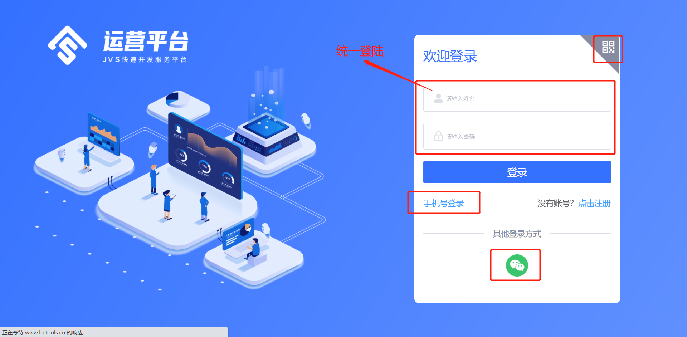

## **项目介绍：**

JVS是面向软件开发团队可以快速实现应用的基础开发框架，采用微服务分布式框架，提供丰富的基础功能，集成众多业务引擎，它灵活性强，界面化配置对开发者友好，底层容器化构建，集合持续化构建。

JVS是“软开企服”推出的面向软件开发团队可以快速实现应用的基础开发框架

**JVS的服务对象：**中小型的开发团队

**JVS的核心目标：**让中小型开发团队过得轻松一点，优化开发团队人力成本高、交付效率低、质量不可控、周期不确定、基础技术投入不足、高端技术支持不够等

## **项目标签**

低代码、微服务、支持SaaS、私有化部署、DevOps、

## **项目构成**

框架前端地址：https://gitee.com/software-minister/jvs-ui

框架后端地址：https://gitee.com/software-minister/jvs

## **体验地址**

开源协议：详见license

**体验地址：http://www.bctools.cn/#/login**

登陆可以通过微信扫码登陆，对于配置数据，请各位技术同学手下留情。

**物理拓扑：

**技术文档地址（微信登陆可查看）：**

**技术栈说明：**

|                | **组件名称**                               | **组件作用**     | **开源协议** |      |
| -------------- | ------------------------------------------ | ---------------- | ------------ | ---- |
| 表现层（前端） | EsLint                                     | 前端代码质量检测 | MIT          |      |
| Vuex           | 前端框架                                   | MIT              |              |      |
| Element-ui     | 前端组件库                                 | MIT              |              |      |
| Crypto-Js      | 前端加密                                   | BSD              |              |      |
| axios          | 基于promise用于浏览器和node.js的http客户端 | MIT              |              |      |
| data-set       | 前端数据绑定                               | MIT              |              |      |
| vue-router     | 前端路由                                   | MIT              |              |      |
| v-charts       | 图形化组件渲染                             | MIT              |              |      |
| E-charts       | 图形化组件渲染                             | Apache 2.0       |              |      |
| WebPack        | 前端代码打包                               | MIT              |              |      |
| G2             | 图形化组件渲染                             | MIT              |              |      |
| G6             | 图形化组件渲染                             | MIT              |              |      |
|                |                                            |                  |              |      |

| **组件归属**           | **组件名称**   | **组件作用**      | **开源协议** |      |
| ---------------------- | -------------- | ----------------- | ------------ | ---- |
| 应用逻辑层（后端框架） | Lombok         | 代码精简          | MIT          |      |
| Mybatis plus           | 数据持久层     | Apache 2.0        |              |      |
| Hutool                 | 底层工具集     | 木兰宽松许可证 V2 |              |      |
| Swagger                | 在线接口文档   | Apache 2.0        |              |      |
| Groovy                 | 敏捷脚本语言   | Apache 2.0        |              |      |
| Spring boot            | 基础脚手架     | Apache 2.0        |              |      |
| spring cloud alibaba   | 微服务框架     | Apache 2.0        |              |      |
| Xxl-job                | 定时任务       | GNU 3.0           | 通过端口调用 |      |
| Nacos                  | 注册中心       | Apache 2.0        |              |      |
| Sentinel               | 接口限流       | Apache 2.0        |              |      |
| seata                  | 分布式事务处理 | Apache 2.0        |              |      |
| Skywalking             | 链路跟踪       | Apache 2.0        |              |      |
| Redisson               | 分布式锁       | Apache 2.0        |              |      |
| RabbitMq               | 消息队列       | MPL 1.1           |              |      |
| Kafka                  | 分布式消息队列 | Apache 2.0        |              |      |

| **组件归属** | **组件名称**            | **组件作用**                 | **开源协议** |      |
| ------------ | ----------------------- | ---------------------------- | ------------ | ---- |
| 数据存储层   | ElasticSearch           | 文件搜索引擎（日志、打文本） | Apache 2.0   |      |
| Mongo        | 分布式文件存储数据库    | Apache 2.0                   |              |      |
| Mysql        | 关系型数据库            | GPL                          | 通过端口调用 |      |
| MariaDB      | MYSQL集群               | GNU 2.0                      | 通过端口调用 |      |
| mycat        | 数据分库                |                              |              |      |
| Redis        | 高性能的key-value数据库 | BSD 3                        |              |      |

| **组件归属** | **组件名称** | **组件作用** | **开源协议** |      |
| ------------ | ------------ | ------------ | ------------ | ---- |
| 运维支持层   | Docker       | 容器         | Apache 2.0   |      |
|              |              |              |              |      |

## **系统部分截图：**

## **技术交流与商务支持：**

